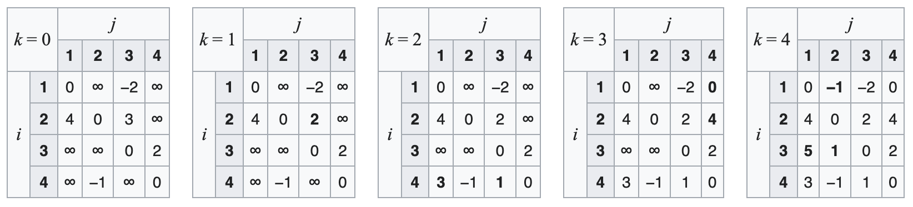

## Definition and Properties

Pathfinding is the plotting of the shortest route between two points. It is a fundamental algorithm in graph theory and has numerous practical applications in various fields, including robotics, video games, and network routing. The properties of a pathfinding algorithm are as follows:
- It finds the shortest path between two points in a graph.
- It can be used to solve a variety of optimization problems, such as finding the shortest route in a transportation network or the most efficient path for a robot to navigate through an environment.

## Applications

Pathfinding algorithms have a wide range of applications in various fields, including:
- Robotics: Pathfinding algorithms are used to plan the most efficient path for a robot to navigate through an environment, avoiding obstacles and minimizing travel time.
- Video games: Pathfinding algorithms are used to create realistic and intelligent non-player characters (NPCs) that can navigate through complex game environments.
- Network routing: Pathfinding algorithms are used to find the most efficient route for data packets to travel through a computer network, minimizing latency and congestion.

## Dijkstra's Algorithm

Consider that for each visited node v, dist[v] is the shortest distance from source to v, and for each unvisited node u, dist[u] is the shortest distance from source to u when traveling via visited nodes only, or infinity if no such path exists. (Note: we do not assume dist[u] is the actual shortest distance for unvisited nodes, while dist[v] is the actual shortest distance)

The base case is when there is just one visited node, namely the initial node source, in which case the hypothesis is trivial.

Next, assume the hypothesis for k-1 visited nodes. Next, we choose u to be the next visited node according to the algorithm. We claim that dist[u] is the shortest distance from source to u.

To prove that claim, we will proceed with a proof by contradiction. If there were a shorter path, then there can be two cases, either the shortest path contains another unvisited node or not.

In the first case, let w be the first unvisited node on the shortest path. By the induction hypothesis, the shortest path from source to u and w through visited node only has cost dist[u] and dist[w] respectively. That means the cost of going from source to u through w has the cost of at least dist[w] + the minimal cost of going from w to u. As the edge costs are positive, the minimal cost of going from w to u is a positive number.

Also dist[u] < dist[w] because the algorithm picked u instead of w.

Now we arrived at a contradiction that dist[u] < dist[w] yet dist[w] + a positive number < dist[u].

In the second case, let w be the last but one node on the shortest path. That means dist[w] + Graph.Edges[w,u] < dist[u]. That is a contradiction because by the time w is visited, it should have set dist[u] to at most dist[w] + Graph.Edges[w,u].

For all other visited nodes v, the induction hypothesis told us dist[v] is the shortest distance from source already, and the algorithm step is not changing that.

After processing u it will still be true that for each visited node w, dist[w] will be the shortest distance from source to w using visited nodes only because if there were a shorter path that doesn't go by u we would have found it previously, and if there were a shorter path using u we would have updated it when processing u.

After all nodes are visited, the shortest path from source to any node v consists only of visited nodes, therefore dist[v] is the shortest distance.

```pseudocode
Dijkstra(G, s):
    for each vertex v in G.V:
        v.d = ∞
        v.π = NIL
    s.d = 0
    Q = G.V
    
    while Q ≠ ∅:
        u = vertex in Q with minimum u.d
        remove u from Q

        for each vertex v in G.Adj[u] which is in Q:
            if v.d > u.d + w(u, v):
                v.d = u.d + w(u, v)
                v.π = u
                
    return G
```

The algorithm initializes the distance of each vertex from the source vertex `s` to infinity and the predecessor of each vertex to `NIL`. It then iteratively relaxes the edges of the graph, updating the distance and predecessor of each vertex as necessary. The algorithm uses a priority queue `Q` to efficiently select the vertex with the minimum distance at each step. The final result is a graph `G` with updated distances and predecessors, which can be used to reconstruct the shortest path from the source vertex to any other vertex.


## Bellman-Ford Algorithm

Consider the base case of induction, i=0 and the moment before for loop is executed for the first time. Then, for the source vertex, source.distance = 0, which is correct. For other vertices u, u.distance = infinity, which is also correct because there is no path from source to u with 0 edges.

For the inductive case, we first prove the first part. Consider a moment when a vertex's distance is updated by v.distance := u.distance + uv.weight. By inductive assumption, u.distance is the length of some path from source to u. Then u.distance + uv.weight is the length of the path from source to v that follows the path from source to u and then goes to v.

For the second part, consider a shortest path P (there may be more than one) from source to v with at most i edges. Let u be the last vertex before v on this path. Then, the part of the path from source to u is a shortest path from source to u with at most i-1 edges, since if it were not, then there must be some strictly shorter path from source to u with at most i-1 edges, and we could then append the edge uv to this path to obtain a path with at most i edges that is strictly shorter than P—a contradiction. By inductive assumption, u.distance after i−1 iterations is at most the length of this path from source to u. Therefore, uv.weight + u.distance is at most the length of P. In the ith iteration, v.distance gets compared with uv.weight + u.distance, and is set equal to it if uv.weight + u.distance is smaller. Therefore, after i iterations, v.distance is at most the length of P, i.e., the length of the shortest path from source to v that uses at most i edges.

If there are no negative-weight cycles, then every shortest path visits each vertex at most once, so at step 3 no further improvements can be made. Conversely, suppose no improvement can be made. Then for any cycle with vertices v[0], ..., v[k−1],

v[i].distance <= v[i-1 (mod k)].distance + v[i-1 (mod k)]v[i].weight

Summing around the cycle, the v[i].distance and v[i−1 (mod k)].distance terms cancel, leaving

0 <= sum from 1 to k of v[i-1 (mod k)]v[i].weight

I.e., every cycle has nonnegative weight.

```pseudocode
BellmanFord(G, s):
    for each vertex v in G.V:
        v.d = ∞
        v.π = NIL
    s.d = 0
    
    for i = 1 to |G.V| - 1:
        for each edge (u, v) in G.E:
            if v.d > u.d + w(u, v):
                v.d = u.d + w(u, v)
                v.π = u
                
    for each edge (u, v) in G.E:
        if v.d > u.d + w(u, v):
            return false
    return true
```

The algorithm initializes the distance of each vertex from the source vertex `s` to infinity and the predecessor of each vertex to `NIL`. It then iteratively relaxes the edges of the graph `|G.V| - 1` times, updating the distance and predecessor of each vertex as necessary. After this, it iterates through the edges of the graph one more time to detect and report any negative-weight cycles that may exist. The final result is a boolean value indicating whether or not the graph contains any negative-weight cycles.


## Floyd-Warshall Algorithm

Consider a graph `G` with vertices `V` numbered 1 through `N`. Further consider a function `shortestPath(i, j, k)` that returns the length of the shortest possible path (if one exists) from `i` to `j` using vertices only from the set `{1, 2, …, k}` as intermediate points along the way. Now, given this function, our goal is to find the length of the shortest path from each `i` to each `j` using any vertex in `{1, 2, …, N}`. By definition, this is the value `shortestPath(i, j, N)`, which we will find recursively.

Observe that `shortestPath(i, j, k)` $\leq$ `shortestPath(i, j, k-1)`: we have more flexibility if we are allowed to use the vertex `k`. If `shortestPath(i, j, k)` is in fact less than `shortestPath(i, j, k-1)`, then there must be a path from `i` to `j` using the vertices `{1, 2, …, k}` that is shorter than any such path that does not use the vertex `k`. Since there are no negative cycles this path can be decomposed as:
1. A path from `i` to `k` that uses the vertices `{1, 2, …, k-1}`, followed by
2. A path from `k` to `j` that uses the vertices `{1, 2, …, k-1}`.

And of course, these must be the shortest such paths, otherwise we could further decrease the length. In other words, we have arrived at the recursive formula: $shortestPath(i, j, k) = min(shortestPath(i, j, k-1), shortestPath(i, k, k-1) + shortestPath(k, j, k-1))$.

Meanwhile, the base case is given by $shortestPath(i, j, 0) = w(i, j)$, where $w(i, j)$ denotes the weight of the edge from `i` to `j` if one exists and $\infty$ (infinity) otherwise.

These formulas are the heart of the Floyd–Warshall algorithm. The algorithm works by first computing shortestPath(i, j, 0) for all `i` and `j`. Then it computes shortestPath(i, j, 1) for all `i` and `j`, and so on, until finally computing shortestPath(i, j, N) for all `i` and `j`. The pseudocode below demonstrates this process.

```pseudocode
FloydWarshall(G):
    let dist be a |G.V| × |G.V| array of minimum distances initialized with ∞
    for each vertex v in G.V:
        dist[v][v] = 0
    for each edge (u, v) in G.E:
        dist[u][v] = w(u, v)
    for k = 1 to |G.V|:
        for i = 1 to |G.V|:
            for j = 1 to |G.V|:
                dist[i][j] = min(dist[i][j], dist[i][k] + dist[k][j])
    return dist
```

The algorithm initializes the distance of each vertex from itself to 0 and the distance of each edge to its weight. It then iteratively updates the distance between all pairs of vertices by considering the distance through a third vertex. The final result is a matrix of minimum distances between all pairs of vertices.




## Time and Space Complexity

Algorithm | Time Complexity | Space Complexity
--- | --- | ---
Dijkstra's | O((V + E) log V) | O(V)
Bellman-Ford | O(V * E) | O(V)
Floyd-Warshall | O($V^3$) | O($V^2$)

Where:
- V is the number of vertices in the graph.
- E is the number of edges in the graph.

## Conclusion

Pathfinding is a fundamental algorithm in graph theory with numerous practical applications in various fields. Dijkstra's algorithm is a popular pathfinding algorithm that efficiently finds the shortest path between two points in a graph. Bellman-Ford algorithm is another pathfinding algorithm that can handle graphs with negative-weight edges and detect negative-weight cycles. Floyd-Warshall algorithm is a third pathfinding algorithm that can find the shortest path between all pairs of vertices in a graph. Each of these algorithms has its own time and space complexity, which makes them suitable for different types of pathfinding problems.